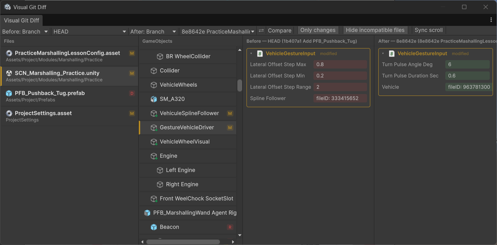

# Visual Git Diff

An Editor window for Unity that shows scene and prefab changes across git
revisions the way the Inspector shows a GameObject: pick two revisions, see
which files changed, drill into a GameObject/component and get a real
before/after field comparison — instead of reading raw YAML in a text diff
tool.



## Features

- Pick any two revisions to compare: branch tip, a specific commit, or the
  current working tree.
- File list scoped to what actually changed between the two revisions.
- GameObject/component tree diff for `.unity` scenes and `.prefab` files,
  including nested `PrefabInstance` overrides.
- Inspector-style before/after field view per object, with an
  "only changes" filter to hide untouched fields.
- Synchronized scrolling between the before/after columns.

## Requirements

- Unity 6000.0 or later.
- A git repository (the target Unity project must be inside one).
- [`org.nuget.yamldotnet`](https://www.nuget.org/packages/YamlDotNet) `18.1.0`,
  resolved through the NuGet-for-Unity scoped registry (see below) — plain
  `package.json` dependencies can't resolve `org.nuget.*` packages on their
  own.

## Installation

1. Add the NuGet scoped registry to your project's `Packages/manifest.json`
   (skip this if it's already there):

   ```json
   "scopedRegistries": [
     {
       "name": "NuGet",
       "url": "https://unitynuget-registry.azurewebsites.net",
       "scopes": ["org.nuget"]
     }
   ]
   ```

2. Add the package via the Unity Package Manager using the git URL:

   ```
   https://github.com/lxtzfr/visual-git-diff.git?path=/Package
   ```

   **Package Manager → `+` → Add package from git URL…**, paste the URL
   above.

## Usage

Open **Window → Visual Git Diff → Diff Window**, pick a revision for each
side (branch, commit, or working tree), select a changed file from the list,
then a GameObject to see its field-by-field diff.

## How it works

Unity scenes and prefabs are plain-text YAML. Visual Git Diff reads both
revisions of a file straight from git (`GitFileReader`), parses them
(`UnityYamlParser`), groups documents into a GameObject/component tree with
nested prefab-instance resolution (`ObjectGrouper` / `PrefabOverrideHydrator`
/ `SourcePrefabResolver`), and diffs matching fields (`UnityYamlDiff`) for
display in the Inspector-style before/after view.

## License

[GNU General Public License v3.0](LICENSE.md)
